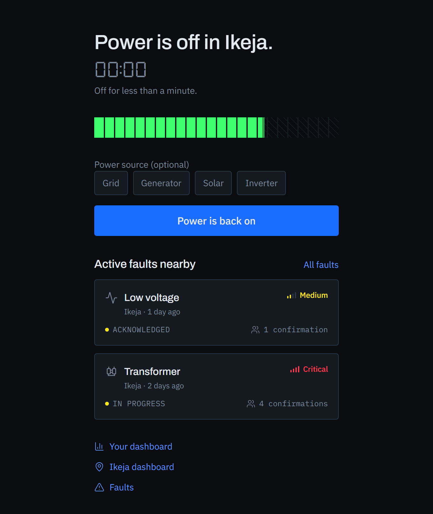
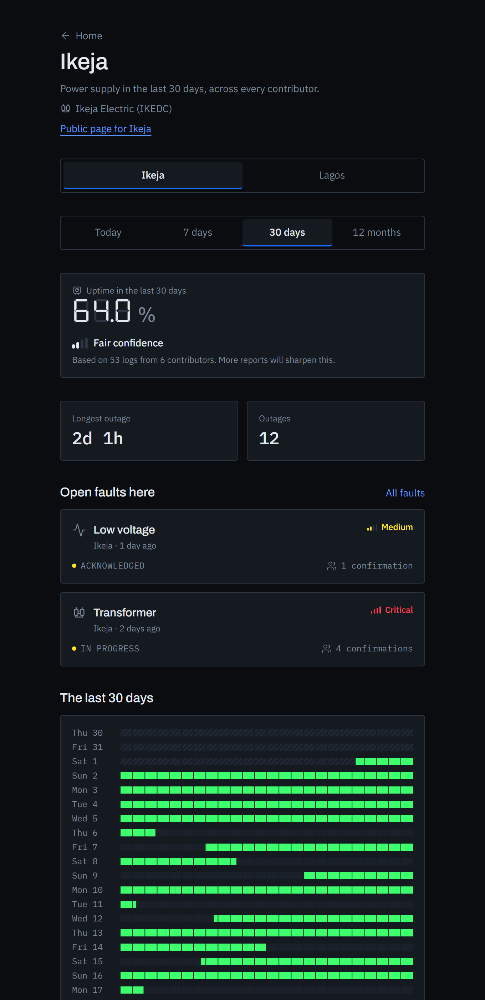
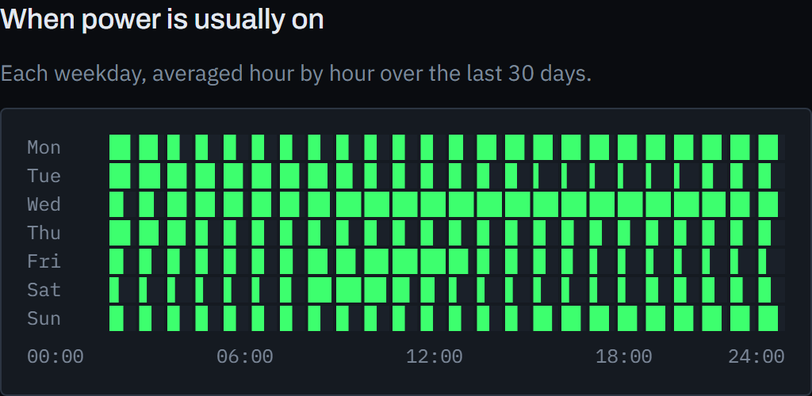
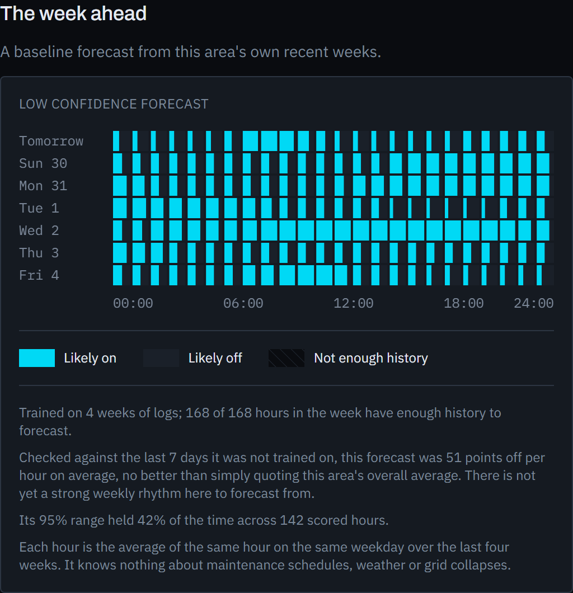
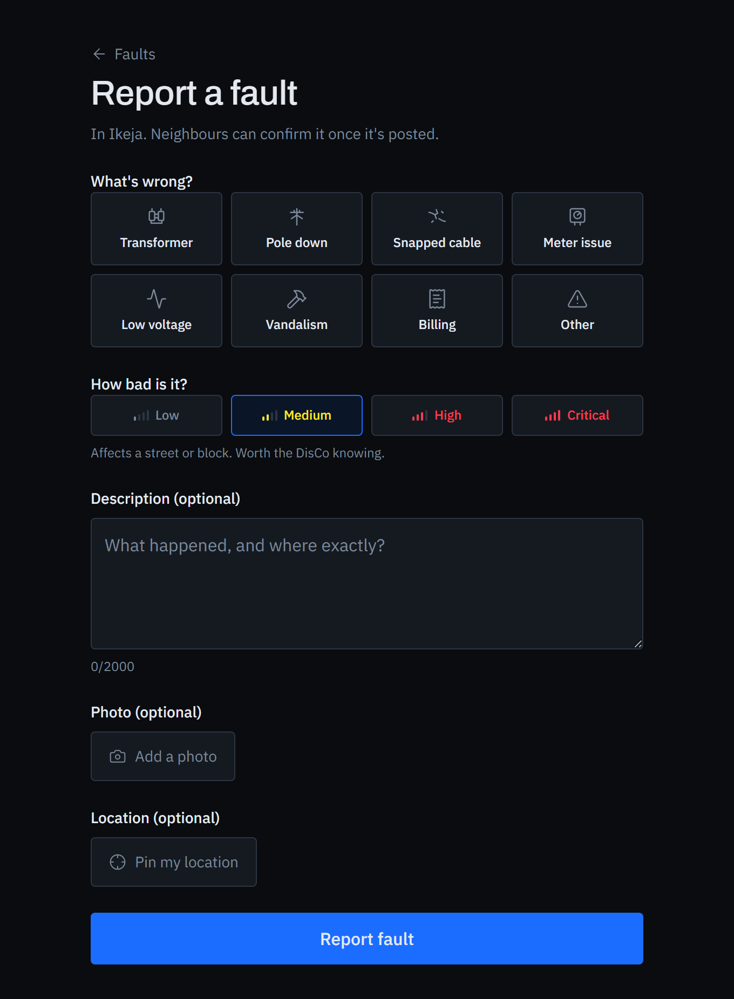
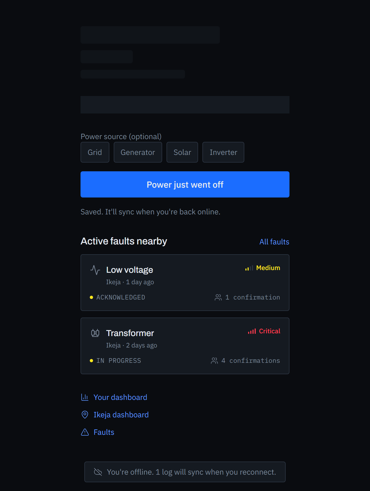
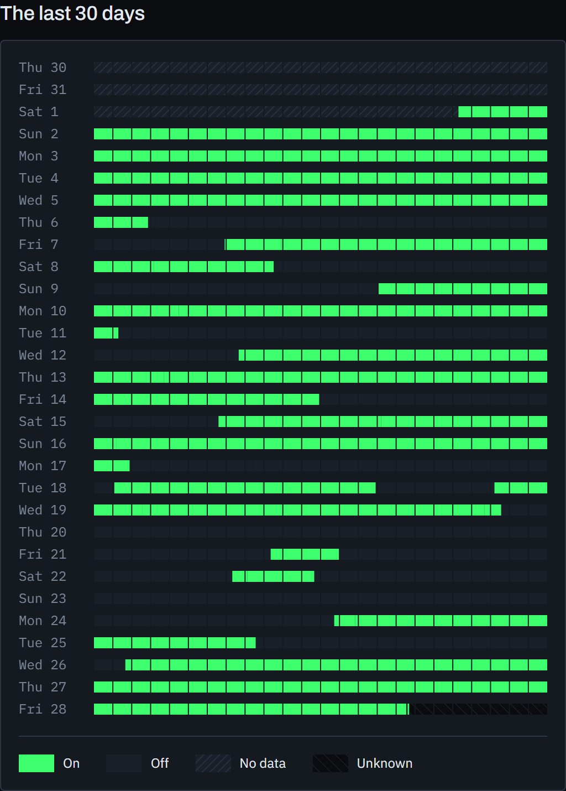
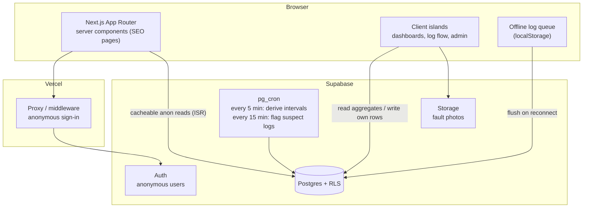

# Nigeria Electricity Tracker

Crowdsourced tracking of electricity availability across all 36 Nigerian states
and the FCT. People log when power goes on or off in their area; the app turns
those discrete events into uptime dashboards, an hour-of-day supply pattern,
fault reports, national rankings, and short-range forecasts.

**Live demo:** _add your Vercel URL after the first deploy_ · **Case study:** this README

> Built as a portfolio flagship. It leans into the parts most CRUD projects skip
> — deriving durations from event logs, scoring confidence on sparse
> crowdsourced data, aggregating time series across a geographic hierarchy, an
> actual moderation and admin layer, and forecasts that report their own error
> rate instead of overselling.

---

## The problem

Grid power in Nigeria is intermittent and unevenly distributed, and there's no
public, granular record of it. "How many hours of light did Akure South get last
week" is a question nobody can answer with data. This is a crowdsourced attempt:
if enough people in an area log the on/off transitions they already notice, the
aggregate becomes a usable picture — per LGA, per state, per hour of the day.

Design constraints that shaped everything else:

- **No auto-detection.** A phone's charging state can't tell grid from
  generator, solar, inverter or power bank. There is no honest passive signal,
  so logging is manual — one tap, and an optional tag for which supply you're on.
- **Store events, not durations.** `power_logs` holds discrete on/off
  timestamps. Every duration in the product is *derived*, on a schedule, into
  `outage_intervals`. Writes stay trivial and history stays fixable.
- **Anonymous auth.** Supabase anonymous sign-in — no email, no password, no
  SMTP. Every device still gets a real `user_id`, so row-level security and
  moderation work, and an account can be upgraded later without losing history.

---

## Screenshots

| Home | Area dashboard |
|---|---|
| Current status, today's ribbon, one-tap logging | Uptime meter, confidence grade, the month barcode |
|  |  |

| Hour-of-day pattern | Baseline forecast |
|---|---|
| When power is usually on, by weekday | Next 7 days, with a low-confidence flag when the history is thin |
|  |  |

| Fault report | Offline logging |
|---|---|
| Custom electrical icons for what Lucide lacks | A failed log is queued and syncs on reconnect |
|  |  |

The admin panel (overview, moderation queue, fault triage, coverage map, audit
log) is staff-gated — screenshots need a promoted account.

The **supply ribbon** is the signature component: a 24-segment strip, one
segment per hour, lit for power and dark for none, with a diagonal hatch for
hours nobody reported. One ribbon is today; seven stacked is a week; thirty is a
month barcode; one per LGA is the comparison view; a fragment is the outage
window on a fault card.



---

## Architecture



**Two request paths, on purpose:**

- **Public area pages** (`/state/<slug>/lga/<slug>`) are server-rendered and
  ISR-cached hourly through a cookie-free anonymous client. A crawler or a
  shared link gets a fast static response with real Open Graph tags.
- **Signed-in screens** (`/`, `/area`, `/dashboard`, `/admin`) are client
  islands that read live from Supabase. The middleware signs every visitor in
  anonymously before the first render, so RLS has a real `auth.uid()` to work
  with immediately.

### Stack

| Layer | Choice |
|---|---|
| Framework | Next.js (App Router) + TypeScript |
| Styling | Tailwind CSS v4, design tokens in `globals.css` |
| Charts | Recharts; raw SVG for the supply ribbon |
| Maps | Leaflet + OpenStreetMap (no API key) |
| Backend | Supabase — Postgres, Auth, Storage, RLS, Realtime |
| Aggregation | Postgres functions + `pg_cron` |
| Hosting | Vercel |

---

## Engineering decisions worth reading

### Deriving durations from an event log

`power_logs` is append-only and immutable to its author. `derive_outage_intervals()`
(migration `0003`) rebuilds `outage_intervals` from it on a 5-minute `pg_cron`
job: per area, over logs ordered by time, a run of consecutive same-status logs
collapses to its *first* log (three "off" reports in a row are three people
seeing one outage), each "off" opens an interval, the next "on" closes it, and a
trailing "off" stays open — that's the "power is off right now" state the status
card reads. It's idempotent and incremental: it upserts on `(area_id, started_at)`
rather than truncating, so untouched history isn't rewritten every five minutes.

### Confidence scoring for sparse data

Early crowdsourced data is thin and a thin number presented confidently is a
lie. Every aggregate carries a confidence grade derived from log count and
distinct contributor count over the window, and the UI never shows a bare
percentage without it: *"Based on 18 logs from 3 contributors. More reports will
sharpen this."* The same thresholds power the admin coverage dashboard, which
asks the opposite question — which of all 774 LGAs are *silent* — so both
screens mean the same thing by "well covered".

### Row-level security model

- **Read** — aggregates, area pages and fault feeds are world-readable, no login.
- **Write** — a signed-in user may insert only `power_logs` and
  `fault_reports` rows where `user_id = auth.uid()`, and only if not banned.
  Logs are immutable after insert.
- **Derived tables** — `outage_intervals` has no write policy at all; only the
  `SECURITY DEFINER` cron job (which bypasses RLS) touches it.
- **Admin** — every admin function opens with `is_moderator_or_admin()` /
  `is_admin()` and *raises* on failure rather than returning filtered rows,
  because `profiles` is partly self-readable and a silent filter would hand a
  regular user quietly-wrong totals instead of a refusal.
- Every admin mutation writes an `admin_audit_log` row in the *same
  transaction*, so an action can't land unrecorded.

See [`supabase/migrations/README.md`](supabase/migrations/README.md) for a
file-by-file account of the schema.

### Offline-tolerant logging

People log *during* outages, and outages often mean no connectivity. A power log
that can't reach Supabase — offline, or a transient failure — is written to a
`localStorage` queue with the real tap time as `logged_at`, and flushed
oldest-first when the connection returns. A bottom strip carries the state
(*"You're offline. Logs will sync when you reconnect."*). The duplicate guard
checks the queue tail too, so a re-tap while offline is still caught.

### Phased forecasting, honest about accuracy

No ML. Phase 1 is statistical pattern detection — hour-of-day and day-of-week
histograms, rolling averages. Phase 2 is a seasonal-naive baseline forecast plus
anomaly detection: an alert fires on a *change* against an area's own recent
baseline, not a level (41% uptime is a crisis in Ikeja and an ordinary week in
Maiduguri), with a significance test against the two windows' combined standard
error and a veto when the reporting *rate* itself swung more than threefold.
Against the current data that pipeline flags 3 of 10 comparable LGAs and
discards the rest as noise.

---

## Local development

**Prerequisites:** Node 20+ (22 recommended), a Supabase project, the
[Supabase CLI](https://supabase.com/docs/guides/cli).

```bash
git clone <this-repo> && cd Electricity-tracker
npm install
cp .env.local.example .env.local   # then fill in your Supabase URL + anon key
```

**Database** — apply the schema and seed to your project:

```bash
supabase link --project-ref <your-ref>
supabase db push                       # runs supabase/migrations in order
psql "$DATABASE_URL" -f supabase/seed/001_states_and_lgas.sql
# ...through 007_demo_admin_actions.sql — see supabase/seed/README.md for order
```

The migrations enable `pg_cron` and schedule the derivation job; on a fresh
project confirm the `pg_cron` and `pg_net` extensions are on
(Database → Extensions).

**Run:**

```bash
npm run dev        # http://localhost:3000
npm run build      # production build
npm run lint
```

The dev server talks to the real Supabase project — there is no local stack.
Reads are free; treat writes as production writes.

---

## Deploy (Vercel)

1. Import the repo on Vercel.
2. Set environment variables:
   - `NEXT_PUBLIC_SUPABASE_URL`
   - `NEXT_PUBLIC_SUPABASE_ANON_KEY`
   - `NEXT_PUBLIC_SITE_URL` — the deployment URL, e.g.
     `https://nigeria-electricity-tracker.vercel.app` (used for canonical URLs,
     OG tags and `sitemap.xml`)
3. Deploy. `robots.txt` and `sitemap.xml` are generated at the edge;
   `/dev/*` scaffolding routes 404 in production.

Interval derivation runs inside Postgres via `pg_cron` — there is no separate
scheduler to wire up on the hosting side.

---

## Project structure

```
src/
  app/                     routes (App Router) + error / not-found / loading / sitemap / robots
  components/
    supply-ribbon/         the signature SVG ribbon, at every scale
    home/  status-card/  log-flow/
    personal-dashboard/    one person's history for their area
    area-dashboard/        the flagship: aggregate uptime, heatmap, comparison, ranking
    faults/                report form, feed, confirmations, Leaflet map
    forecast/              pattern detection + baseline forecast + anomaly banner
    admin/                 overview, moderation, triage, coverage, locations, audit
    location-picker/  icons/  offline/
  lib/
    supabase/              browser / server / cookie-free clients, generated types
    auth/  offline/  hooks/  time/
supabase/
  migrations/              schema, RLS, aggregate functions, cron jobs (0001–0014)
  seed/                    36 states + 774 LGAs, demo users, logs, faults
docs/                      project plan, design system, screenshots
```

---

## Milestones

| | Scope |
|---|---|
| M1 | Repo, Supabase schema + RLS, seed all states/LGAs, anonymous auth, location picker, supply ribbon in isolation |
| M2 | Log flow with duplicate prevention, current status card, interval derivation job, restoration animation |
| M3 | Personal dashboard — daily/weekly/monthly charts, uptime %, longest outage, outage count |
| M4 | Area dashboard (flagship) — aggregate uptime, month ribbon grid, hour-of-day heatmap, LGA comparison, national ranking, confidence badges, public area pages; DisCo dimension; custom icons |
| M5 | Fault reporting — form with photo upload, feed, confirmations, map view |
| M6 | Admin panel — overview, moderation queue, fault triage, coverage dashboard, location management, audit log; CSV export |
| M7 | Forecasting phases 1 & 2 — pattern detection, baseline forecasts, anomaly alerts |
| M8 | Polish — offline log queue, error/not-found boundaries, SEO (sitemap, robots, OG), accessibility pass, this README, deploy |

---

## Known limitations / future work

- **Fault reports aren't queued offline** — only power logs are. Queuing a photo
  blob in `localStorage` is a bigger job; for now a failed fault submit keeps
  your input and asks you to retry.
- **Forecasting stops at phase 2.** Phase 3 (a real time-series model, backtested
  and showing its error rate) waits for real data volume.
- **No React Native companion yet** — the Supabase backend is ready to be reused
  by one.
- **Light mode is minimal.** The app is dark-native by design (people open it
  during outages, often at night); a full light theme is low priority.

---

## Quality floor

Responsive to 320px · visible keyboard focus rings on every interactive element ·
skip-to-content link · `prefers-reduced-motion` respected (the one animated
moment — a ribbon segment surging when power is restored — becomes an instant
fill) · skeletons on every async surface, never spinners · neon reserved for
marks that carry meaning, never large fills, never as the only signal (on/off
differ in position and the no-data hatch, not just colour) · all signal colours
checked for AA contrast against the near-black base.
